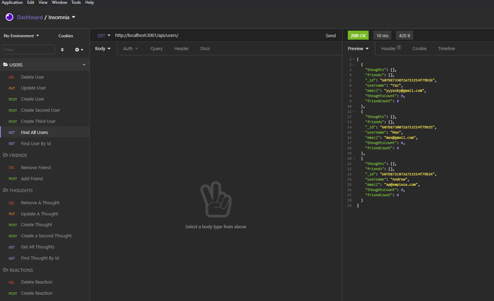

# Social Network API-Week-18-challenge
  

  ## Description
This is an API for a social network web application, where users can share their thoughts, react to firends' thoughts and create a friend list 

  * Link for Screencastify video [Screencastify](https://guarded-reaches-64579.herokuapp.com/)      
  * Link for MP4 format in the event Screencastify is blurry [MP4](https://guarded-reaches-64579.herokuapp.com/)    
  * Link for GitHub Repository [GitHub](https://github.com/a7063p/week-18-challenge.git)  

  ## Table of Contents
  * [Installation](#Installation)
  * [Usage](#Usage)
  * [License](#License)
  * [Languages](#Languages)  
  
  
  * [Questions](##Questions) 
  

  ## Installation
    This application is an API only and requires the use of mongoDB. Users will be required to use  Insomnia to view the APi routes. Users will need to utilize NPM Install in order to load NPM packages. Once all required packages are installed the user will start the express server utilizing npm start to access (localhost:3001/).
    * Utilizes NPM Package Express
    * Utilizes NPM Mongoose
    
      ## Usage
    The API Routes for all user and thought models:
- User(s)
    *   Create a user: `<POST> http://localhost:3001/api/users`
    *   Find all users: `<GET> http://localhost:3001/api/users`
    *   Find a user by ID: `<GET> http://localhost:3001/api/users/<userId>`
    *   Update a user: `<PUT> http://localhost:3001/api/users/<userId>`
    *   Delete a user: `<DELETE> http://localhost:3001/api/users/<userId>`
- Friend(s)
    *   Add a friend: `<POST> http://localhost:3001/api/users/<userId>/friend/<friendId>`
    *   Remove a friend: `<POST> http://localhost:3001/api/users/<userId>/friend/<friendId>`
- Thought(s)
    *   Create a thought: `<POST>http://localhost:3001/api/thoughts/<userId>`
    *   Get all thoughts: `<GET>http://localhost:3001/api/thoughts`
    *   Get a thoughts by ID: `<GET>http://localhost:3001/api/thoughts/<thoughtId>`
    *   Update a thought: `<PUT>http://localhost:3001/api/thoughts/<thoughtId>`
    *   Remove a thought: `<DELETE>http://localhost:3001/api/thoughts/<thoughtId>`

- Reaction(s)
    * Create a reaction:`<POST>http://localhost:3001/api/thoughts/user/<userId>/thought/<thoughtId>`  
    * Delete a reaction:`<POST>http://localhost:3001/api/thoughts/user/<userId>/thought/<thoughtId>`  
    

  

    
  
  ## Languages  
    
    
    
    
    
    
    
 

  ## License
  
  
  This application currently is licensed with MIT. 
 

  

  ## Contribute
  Contributor privileges are open to ALL that want to positively contribute to this project

  
  

  ## Questions
  Please feel free to email me with any comments, questions or concerns at ap@ampiUSA.com

  [GitHub Account](https://github.com/a7063p)
